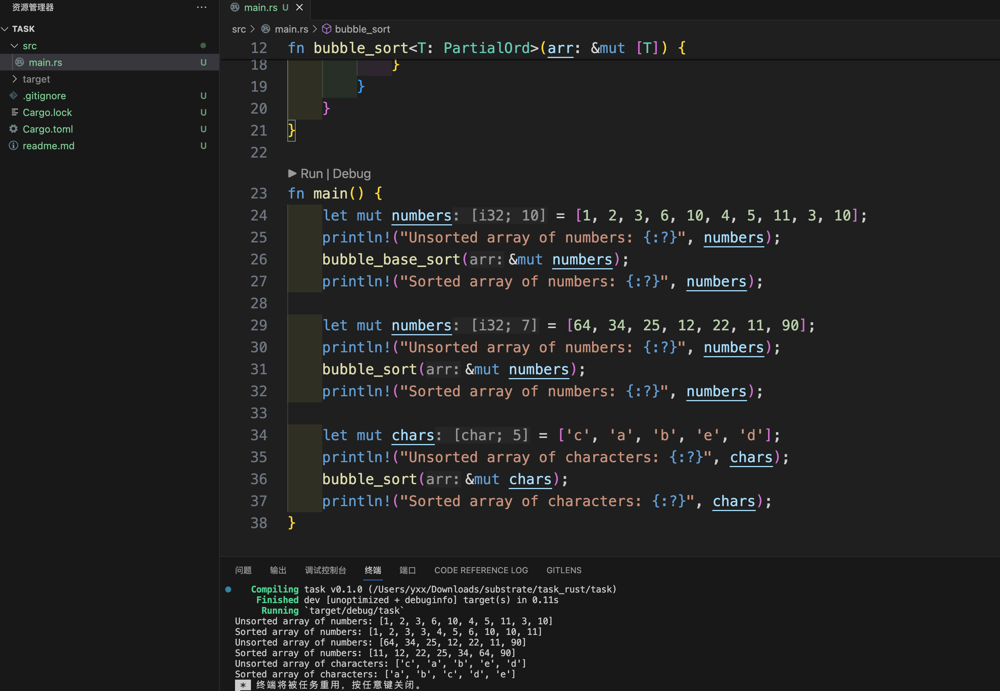

# Task: Rust语言写一个冒泡排序的算法

## 基础实现

```rust
fn bubble_base_sort(arr: &mut [i32]) {
    let len = arr.len();
    for i in 0..len {
        for j in 0..len - i - 1 {
            if arr[j] > arr[j + 1] {
                arr.swap(j, j + 1);
            }
        }
    }
}
```

## 进阶实现

```rust
fn bubble_sort<T: PartialOrd>(arr: &mut [T]) {
    let len = arr.len();
    for i in 0..len {
        for j in 0..len - i - 1 {
            if arr[j] > arr[j + 1] {
                arr.swap(j, j + 1);
            }
        }
    }
}
```

## 运行截图

